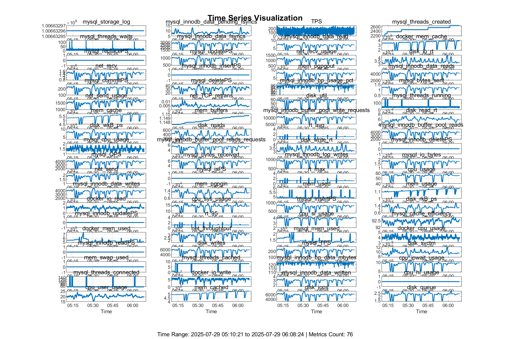
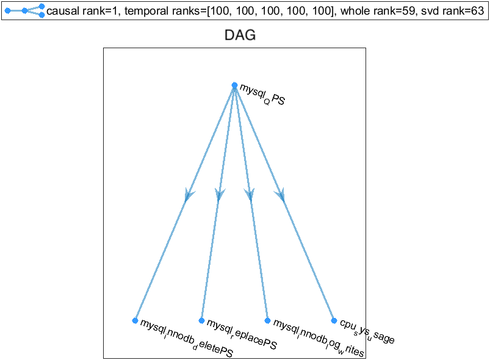

# $LoR\lambda$-Mon

$LoR\lambda$-Mon is an adaptive monitoring framework designed for low-overhead and robust fine-grained QoS metrics monitoring. At its core lies the **Lo**w-**R**ank and **λ**-based Frequency Estimation **Model** ($LoR\lambda$), which incorporates the following key features:

## Key Features

**Sparse Causal Structure (SCS)**
Reveals that each performance metric is typically influenced by only a few other metrics, forming disjoint Directed Acyclic Graphs (DAGs). This structure enables optimal model complexity to overcome the Bias-Variance Dilemma.

**Root-cause Metric Identification**
Identifies all root-cause metrics within each DAG to enhance monitoring data inference accuracy.

**Low-Rank-based Frequency Estimation Model**

- Calculates sampling frequency for root-cause metrics based on historical low-rank structure
- Determines sampling frequency for effect metrics using Causal Matrix Completion

**Lambda-based Frequency Estimation Model**

- Predicts anomaly occurrence probability by learning inter-anomaly excitation patterns from historical data
- Computes sampling frequency for each metric based on anomaly probability

**Fine-grained Inference**
Reconstructs unsampled data across all metrics using both intra-metric temporal patterns and inter-metric causal relationships.

The complete pipeline is illustrated in Figure 3 of our paper.

## Appendix

**paperID_1224_Appendix.pdf** contains the proof of Theorem 4.1 (Causal Matrix Completion).

## Testbed

Our testbed architecture is shown below. OLTPBench deployed on a server accesses the MySQL database running on a Kubernetes cluster. We collect numerous metrics using Prometheus to generate a millisecond-level multi-metric dataset.

### Fault Injection

We inject three common types of faults:

- Abnormal workload
- CPU saturation
- Memory saturation

The fault injection strategy described in our paper's Evaluation section is implemented in `fault_injection.sh`. Simply run this file after launching OLTPBench.

## Dataset

The collected data is exported as **combine_metrics_510_608.csv**, with fault injection time ranges recorded in **fault_timeline_510_608.csv**. We employ a Cauchy distribution-based anomaly detection method (SIGMOD'18) to label data points deviating from normal states. The complete labeled dataset is organized as **combine_metrics_510_608_with_labels.csv**, where:

- `label_1`: Fault injection time range
- `label_2`: Anomaly labels

This processed dataset serves as input to our framework: `mysql_510_608_withLabels.mat`

### Dataset Details

- **77 performance metrics**, each with corresponding definitions and PromQL queries
- **Visualization**: The figure below shows the time series data, with red segments indicating anomalies:

The red color denotes the anomaly.

## Code Structure

**`LoRlambda_Mon.m`**
The core implementation of our adaptive monitoring model, containing all modules from Figure 3 in the paper. Executing this script generates:

- Sparse causal structure visualizations
- DAGs for different metric clusters
- Corresponding adjacency matrices

**Example Output**: A sample DAG generated by $LoR\lambda$-Mon:

This visualization demonstrates:

1. QPS increases drive fluctuations in four other metrics
2. The submatrix formed by these five metrics has a causal rank of 1, significantly lower than the full matrix's SVD rank of 63

### Sub-functions

- **`subfunc_clustering_by_SSC.m`**: Performs sparsification
- **`subfunc_CausalStructureLearning.m`**: Implements causal structure learning
- **`subfunc_RCMI_ACE.m`**: Identifies root-cause metrics using ACE method
- **`subfunc_robust_AnomalyDetect_Cauchy.m`**: Robust anomaly detection based on Cauchy distribution
- **`subfunc_robust_OAM_LoRLambda.m`**: Implements LoRLambda-sampling (Section 5.1)
- **`subfunc_robust_OAM_learn_mbp.m`**: Learns Lambda model using EM algorithm
- **`subfunc_robust_OAM_update_mbp.m`**: Incrementally updates Lambda model with new anomaly data

