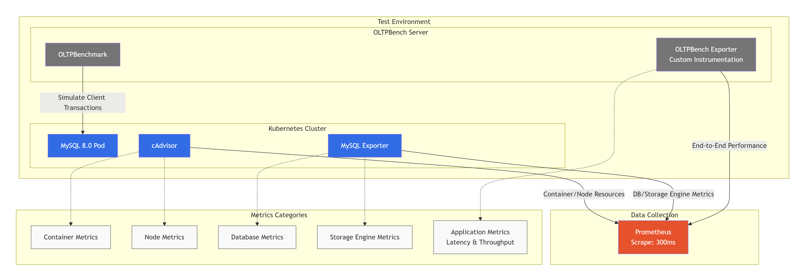
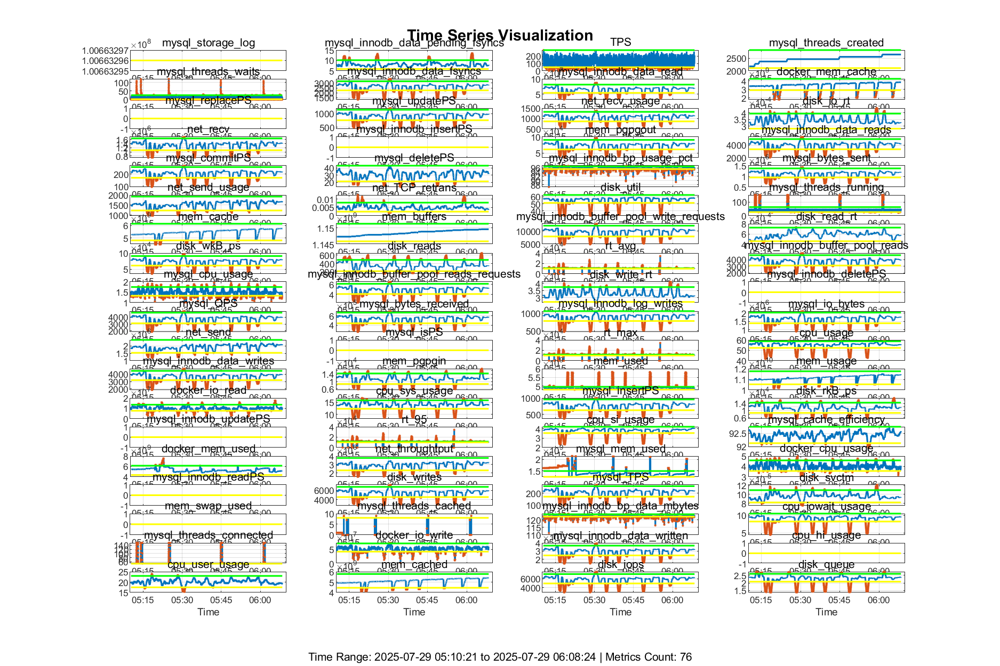

# LoRlambda-Mon

LoRlambda-Mon is a sparse causal structure-driven adaptive multi-metric monitoring framework. It is designed to minimize monitoring overhead for massive fine-grained metrics while still effectively observing critical, fleeting anomaly events.

The project is organized so readers can reproduce the paper experiment, inspect each algorithm stage, and adapt the code to their own multi-metric monitoring datasets.

## What the project does

LoRlambda-Mon reduces monitoring overhead by deciding **which metric values need to be sampled** and when anomaly-sensitive metrics should be observed more frequently. It combines:

- **Sparse causal structure learning** to group metrics and learn parent/child relationships.
- **Anomaly separator** to separate normal metric dynamics from anomaly-driven observations.
- **Low-rank sampling** with a tighter sampling bound than the optimal sampling bound, reducing the overhead of monitoring normal data.
- **Lambda-based sampling** based on the observation that anomalies propagate across related performance metrics.
- **Fine-grained inference** to infer missing fine-grained data via temporal and causal correlations across multiple metrics.

See [`docs/algorithm_overview.md`](docs/algorithm_overview.md) for a code-level walkthrough.

## Repository layout

```text
LoR-lambda-Mon/
|-- README.md
|-- CONTRIBUTING.md
|-- docs/
|   |-- algorithm_overview.md
|   `-- data_format.md
|-- dataset/
|   |-- combined_metrics_510_608.csv
|   |-- combined_metrics_510_608_with_labels.csv
|   |-- BARO_OB_w7T50.mat      # local, ignored by Git
|   |-- BARO_SS_w7T50.mat              # local, ignored by Git
|   `-- *.png
|-- src/
|   |-- config.m                         # Algorithm/visualization/logging parameters
|   |-- import_dataset_from_csv.m         # Import CSV datasets into ignored MAT files
|   |-- validate_lorlambda_mon.m          # Lightweight health check
|   |-- LoRlambda_Mon.m                   # Friendly multi-dataset experiment runner
|   |-- LoR_lambda_Mon.m                  # Core online monitoring algorithm
|   |-- data_preprocess.m                 # Filtering, labeling, normalization
|   `-- subfunc_*.m                       # Algorithm components
`-- testbed/
    |-- run_oltpbench.sh
    |-- fault_orchestrator_paper.sh
    `-- testbed_framework.png
```

## Prerequisites

- MATLAB R2021b or later.
- MATLAB toolboxes used by the experiment:
  - Statistics and Machine Learning Toolbox
  - Signal Processing Toolbox
  - Optimization Toolbox

## Quick start

### 1. Clone the project

```bash
git clone <repository-url>
cd LoR-lambda-Mon
```

### 2. Open MATLAB in the source directory

```matlab
cd('path/to/LoR-lambda-Mon/src')
```

### 3. Run one of the supported datasets

```matlab
% Default: OLTP dataset
LoRlambda_Mon

% Equivalent explicit call
LoRlambda_Mon('oltp')

% BARO FSE24 microservice datasets
LoRlambda_Mon('online_boutique')
LoRlambda_Mon('sock_shop')
```

The runner prints and returns a `results` struct containing the main metrics:

- sampling rate
- NMAE
- precision
- recall
- F1 score
- average CPU overhead for decision, sampling, inference, and model update

### 4. Validate a dataset before running

```matlab
validate_lorlambda_mon('oltp')
validate_lorlambda_mon('online_boutique')
validate_lorlambda_mon('sock_shop')
```

### 5. Rebuild MAT files from CSV when needed

The repository stores CSV files where possible. MATLAB `.mat` files are generated locally and ignored by Git.

```matlab
% Rebuild the default OLTP MAT file from its labeled CSV
import_dataset_from_csv

% Convert a BARO simple_data.csv file into a directly runnable MAT file
import_dataset_from_csv('path/to/simple_data.csv', ...
    '../dataset/BARO_OB_w7T50.mat', ...
    'baro')
```

More details are in [`docs/data_format.md`](docs/data_format.md).

## Configuration

Dataset selection is done through the simple running interface:

```matlab
LoRlambda_Mon                  % OLTP
LoRlambda_Mon('online_boutique')
LoRlambda_Mon('sock_shop')
```

Edit [`src/config.m`](src/config.m) only for algorithm, visualization, or logging parameters. Common settings:

```matlab
params.theta_r = 5e-6;      % Root/normal-data sampling parameter
params.theta_c = 1e-1;      % Child/effect-metric sampling parameter
params.yita = 1e-6;         % Subspace estimation threshold
params.beta = 2;            % Model update batch interval
params.SPIKE_LIMIT = 0.92;  % Cauchy spike threshold
params.DIP_LIMIT = 0.08;    % Cauchy dip threshold
```

Set `visualization.enable = false` in `src/config.m` for headless runs.

## Dataset and testbed

The default OLTP dataset contains Prometheus-style OLTP/Kubernetes performance metrics collected from the testbed below.



The labeled time series visualization marks anomalous periods in red:



Fault-injection scripts are in [`testbed/`](testbed/):

- `run_oltpbench.sh`: launches OLTPBench workload generation.
- `fault_orchestrator_paper.sh`: injects workload, CPU, and memory faults.

## Main source files

| File | Purpose |
| --- | --- |
| `src/LoRlambda_Mon.m` | End-to-end multi-dataset runner and evaluation summary |
| `src/LoR_lambda_Mon.m` | Core LoRlambda-Mon online algorithm |
| `src/data_preprocess.m` | Metric filtering, Cauchy labeling, normalization, enhanced matrix construction |
| `src/subfunc_clustering_by_SSC.m` | Sparse subspace clustering |
| `src/subfunc_CausalStructureLearning.m` | Sparse causal structure learning |
| `src/subfunc_robust_OAM_LoRLambda_w.m` | Low-rank plus lambda-based adaptive sampling |

## Citation

If you use this code in research, please cite the paper. Replace the placeholder fields below with the final publication metadata.

```bibtex
@inproceedings{LoRlambdaMon,
  title = {LoR$\lambda$-Mon: Data-Efficient Adaptive Monitoring for Fine-Grained Multi-Metric Streams via Structure-Aware and Anomaly-Predictive Sampling},
  author = {Your Name and Co-authors},
  booktitle = {To appear},
  year = {2026}
}
```

## License

This project is released under the MIT License.

Copyright (c) 2026 LoRlambda-Mon Authors

See [`LICENSE`](LICENSE).
