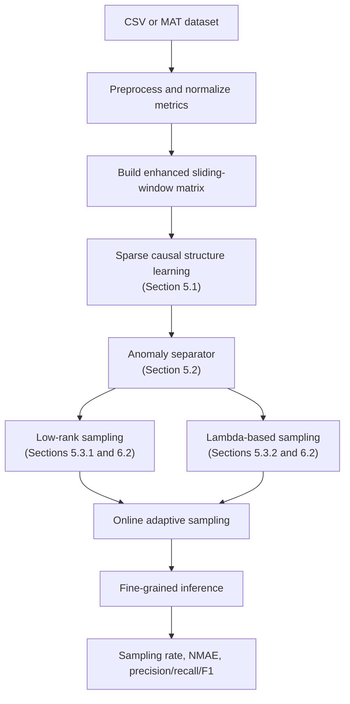

# Algorithm overview

LoRλ-Mon is a sparse causal structure-driven adaptive multi-metric monitoring pipeline.  The goal is to minimize monitoring overhead for massive fine-grained metrics while still observing critical, short-lived anomaly events.

## Notation

| Symbol | Meaning |
| --- | --- |
| `M` | Number of metrics after preprocessing |
| `N` | Number of time steps in the original timeline |
| `T` | Samples per monitoring batch |
| `w` | Number of batches in the original training window |
| `w_size` | Number of enhanced training batches (`T*w - T + 1`) |
| `X` | Normalized `M × N` metric matrix |
| `X_e` | Enhanced matrix used by the sliding-window model |
| `Omega` | Binary mask indicating sampled points |
| `B` | Learned sparse causal adjacency matrix |

## Pipeline and paper sections

## Stage summary

| Stage | Paper section | Purpose |
| --- | --- | --- |
| Sparse causal structure learning | Section 5.1 | Learn metric clusters and sparse parent/child relationships across metrics. |
| Anomaly separator | Section 5.2 | Separate normal metric dynamics from anomaly-driven observations. |
| Low-rank sampling | Sections 5.3.1 and 6.2 | Use a tighter sampling bound than the optimal sampling bound to reduce normal-data monitoring overhead. |
| Lambda-based sampling | Sections 5.3.2 and 6.2 | Model anomaly propagation across related metrics with an SCS-driven Hawkes process and predict future anomaly probability. |
| Fine-grained inference | Inference module | Infer missing fine-grained data via temporal and causal correlations across multiple metrics. |

## Source-code map

| Stage | Main files |
| --- | --- |
| Entry point and evaluation | `src/LoRlambda_Mon.m` |
| Core online algorithm | `src/LoR_lambda_Mon.m` |
| Dataset conversion | `src/import_dataset_from_csv.m` |
| Preprocessing and enhanced matrix construction | `src/data_preprocess.m` |
| Sparse subspace clustering | `src/subfunc_clustering_by_SSC.m`, `src/OMP_ordering_mat_func.m` |
| Sparse causal structure learning | `src/subfunc_CausalStructureLearning.m`, `src/subfunc_CausalDiscovery_Dlingam.m` |
| Anomaly separator / robust anomaly detection | `src/subfunc_robust_AnomalyDetect_Cauchy*.m` |
| Lambda model learning/update | `src/subfunc_robust_OAM_learn_mbp.m`, `src/subfunc_robust_OAM_update_mbp.m` |
| Low-rank plus lambda-based adaptive sampling | `src/subfunc_robust_OAM_LoRLambda_w.m` |
| Fine-grained inference | `src/subfunc_inferEffect_ALS.m` and the inference blocks in `src/LoR_lambda_Mon.m` |

## Reading order for new contributors

1. Read `README.md` for setup and expected outputs.
2. Open `src/config.m` to understand experiment constants.
3. Read `src/data_preprocess.m` to see the exact input matrix format.
4. Read `src/LoRlambda_Mon.m` for the experiment flow and metrics.
5. Read `src/LoR_lambda_Mon.m` only after the high-level flow is clear.

The core function has many outputs to preserve compatibility with the original paper experiment.  If you build new experiments, prefer collecting only the fields you need into a smaller result struct.
